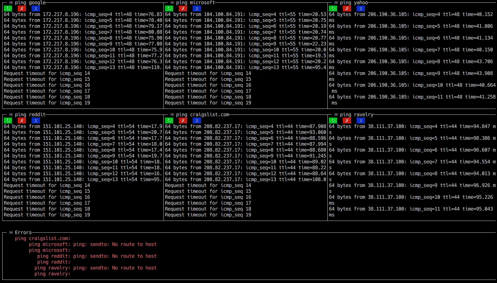

# terminus-maximus [](https://npmjs.org/package/terminus-maximus) [](https://travis-ci.org/Eric%20Wooley/terminus-maximus)

> Run concurrent command line commands in an organized and readable way

## Installation

```sh
$ npm install --save @tww/terminus-maximus
```

## Usage
1. create a .terminusMaximus file (JSON), eg:

See the api config below for about these options
```js
{
  "errorHeight": 20,
  "screensPerRow": 3,
  "scripts": {
    "ping": [
      {
        "label": "ping google",
        "command": "ping www.google.com",
        "screenConfig": {}
      },
      {
        "label": "ping microsoft",
        "command": "ping www.microsoft.com",
        "screenConfig": {}
      },
      {
        "label": "ping yahoo",
        "command": "ping www.yahoo.com",
        "screenConfig": {}
      },
      {
        "label": "ping reddit",
        "command": "ping www.reddit.com",
        "screenConfig": {}
      },
       {
        "label": "ping craigslist.com",
        "command": "ping www.craigslist.com",
        "screenConfig": {}
      },
       {
        "label": "ping ravelry",
        "command": "ping www.ravelry.com",
        "screenConfig": {}
      }
    ],
     "http": [
      
    ]
  }
}
```
2. add an npm script for your command, eg `ping`.
```js
//...
"scripts": {
  "ping" "termax ping"
}
//...
```

3. run `npm run ping` and behold, your readable output of 6 pings.




# API

## Typedefs

<dl>
<dt><a href="#TerminusMaximusConfig">TerminusMaximusConfig</a></dt>
<dd></dd>
<dt><a href="#CommandConfig">CommandConfig</a> : <code>Object</code></dt>
<dd><p>Config for a command.</p>
</dd>
</dl>
<a name="TerminusMaximusConfig"></a>

## TerminusMaximusConfig
**Kind**: global typedef  
**Properties**

| Name | Type | Description |
| --- | --- | --- |
| errorHeight | <code>Number</code> | The height for the error console |
| scripts | <code>Object.&lt;string, Array.CommandConfig&gt;</code> | Config for each command group to run |
| screensPerRow | <code>Number</code> | The number of screens per row |

<a name="CommandConfig"></a>

## CommandConfig : <code>Object</code>
Config for a command.

**Kind**: global typedef  
**Properties**

| Name | Type | Description |
| --- | --- | --- |
| label | <code>String</code> | The label to show in above your command |
| command | <code>String</code> | Command to run |
| screenConfig | <code>Object</code> | Blessed.Screen Config |

## Functions

<dl>
<dt><a href="#renderScreens">renderScreens(config, scriptToExecute)</a></dt>
<dd><p>Renders the screens and executes the script group</p>
</dd>
</dl>

<a name="renderScreens"></a>

## renderScreens(config, scriptToExecute)
Renders the screens and executes the script group

**Kind**: global function  

| Param | Type | Description |
| --- | --- | --- |
| config | [<code>TerminusMaximusConfig</code>](#TerminusMaximusConfig) | - terminus maximus config object |
| scriptToExecute | <code>String</code> | which script to execute from the config |


## License

MIT © [Eric Wooley](ericwooley.github.com)
